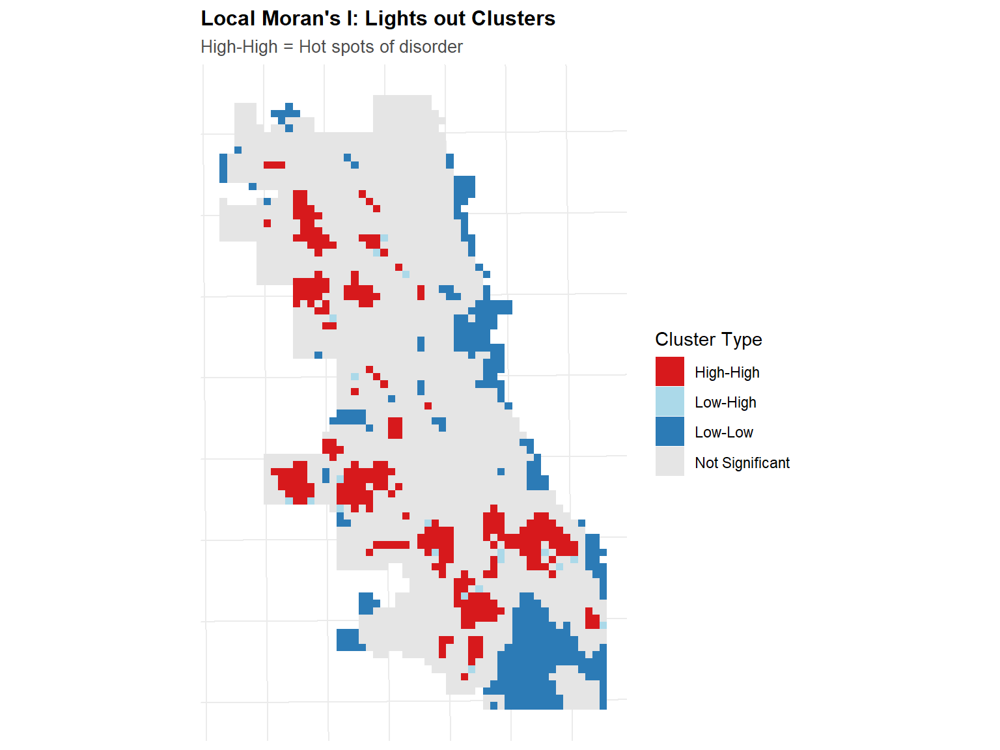

## About This Exercise

In this exercise, I will build a spatial predictive model for burglaries using count regression and spatial features.

# Learning Objectives

By the end of this exercise, you will be able to:

1.  Create a fishnet grid for aggregating point-level crime data
2.  Calculate spatial features including k-nearest neighbors and distance measures
3.  Diagnose spatial autocorrelation using Local Moran's I
4.  Fit and interpret Poisson and Negative Binomial regression for count data
5.  Implement spatial cross-validation (Leave-One-Group-Out)
6.  Compare model predictions to a Kernel Density Estimation baseline
7.  Evaluate model performance using appropriate metrics

# Setup


::: {.cell}

```{.r .cell-code}
# Load required packages
library(tidyverse)      # Data manipulation
library(sf)             # Spatial operations
library(here)           # Relative file paths
library(viridis)        # Color scales
library(terra)          # Raster operations (replaces 'raster')
library(spdep)          # Spatial dependence
library(FNN)            # Fast nearest neighbors
library(MASS)           # Negative binomial regression
library(patchwork)      # Plot composition (replaces grid/gridExtra)
library(knitr)          # Tables
library(kableExtra)     # Table formatting
library(classInt)       # Classification intervals
library(here)

# Spatstat split into sub-packages
library(spatstat.geom)    # Spatial geometries
library(spatstat.explore) # Spatial exploration/KDE

# Set options
options(scipen = 999)  # No scientific notation
set.seed(5080)         # Reproducibility

# Create consistent theme for visualizations
theme_crime <- function(base_size = 11) {
  theme_minimal(base_size = base_size) +
    theme(
      plot.title = element_text(face = "bold", size = base_size + 1),
      plot.subtitle = element_text(color = "gray30", size = base_size - 1),
      legend.position = "right",
      panel.grid.minor = element_blank(),
      axis.text = element_blank(),
      axis.title = element_blank()
    )
}

# Set as default
theme_set(theme_crime())

cat("✓ All packages loaded successfully!\n")
```

::: {.cell-output .cell-output-stdout}

```
✓ All packages loaded successfully!
```


:::

```{.r .cell-code}
cat("✓ Working directory:", getwd(), "\n")
```

::: {.cell-output .cell-output-stdout}

```
✓ Working directory: D:/MUSA5080PPA/portfolio-setup-ChristineCui12/labs/lab_4 
```


:::
:::


# Part 1: **Data Loading & Exploration**

## 1.1: Load Chicago Spatial Data


::: {.cell}

```{.r .cell-code}
# Load police districts (used for spatial cross-validation)
policeDistricts <- 
  st_read("https://data.cityofchicago.org/api/geospatial/24zt-jpfn?method=export&format=GeoJSON") %>%
  st_transform('ESRI:102271') %>%
  dplyr::select(District = dist_num)
```

::: {.cell-output .cell-output-stdout}

```
Reading layer `OGRGeoJSON' from data source 
  `https://data.cityofchicago.org/api/geospatial/24zt-jpfn?method=export&format=GeoJSON' 
  using driver `GeoJSON'
Simple feature collection with 25 features and 2 fields
Geometry type: MULTIPOLYGON
Dimension:     XY
Bounding box:  xmin: -87.94011 ymin: 41.64455 xmax: -87.52414 ymax: 42.02303
Geodetic CRS:  WGS 84
```


:::

```{.r .cell-code}
# Load police beats (smaller administrative units)
policeBeats <- 
  st_read("https://data.cityofchicago.org/api/geospatial/n9it-hstw?method=export&format=GeoJSON") %>%
  st_transform('ESRI:102271') %>%
  dplyr::select(Beat = beat_num)
```

::: {.cell-output .cell-output-stdout}

```
Reading layer `OGRGeoJSON' from data source 
  `https://data.cityofchicago.org/api/geospatial/n9it-hstw?method=export&format=GeoJSON' 
  using driver `GeoJSON'
Simple feature collection with 277 features and 4 fields
Geometry type: MULTIPOLYGON
Dimension:     XY
Bounding box:  xmin: -87.94011 ymin: 41.64455 xmax: -87.52414 ymax: 42.02303
Geodetic CRS:  WGS 84
```


:::

```{.r .cell-code}
# Load Chicago boundary
chicagoBoundary <- 
  st_read("https://raw.githubusercontent.com/urbanSpatial/Public-Policy-Analytics-Landing/master/DATA/Chapter5/chicagoBoundary.geojson") %>%
  st_transform('ESRI:102271')
```

::: {.cell-output .cell-output-stdout}

```
Reading layer `chicagoBoundary' from data source 
  `https://raw.githubusercontent.com/urbanSpatial/Public-Policy-Analytics-Landing/master/DATA/Chapter5/chicagoBoundary.geojson' 
  using driver `GeoJSON'
Simple feature collection with 1 feature and 1 field
Geometry type: POLYGON
Dimension:     XY
Bounding box:  xmin: -87.8367 ymin: 41.64454 xmax: -87.52414 ymax: 42.02304
Geodetic CRS:  WGS 84
```


:::

```{.r .cell-code}
cat("✓ Loaded spatial boundaries\n")
```

::: {.cell-output .cell-output-stdout}

```
✓ Loaded spatial boundaries
```


:::

```{.r .cell-code}
cat("  - Police districts:", nrow(policeDistricts), "\n")
```

::: {.cell-output .cell-output-stdout}

```
  - Police districts: 25 
```


:::

```{.r .cell-code}
cat("  - Police beats:", nrow(policeBeats), "\n")
```

::: {.cell-output .cell-output-stdout}

```
  - Police beats: 277 
```


:::
:::


::: callout-note
## Coordinate Reference System

We're using `ESRI:102271` (Illinois State Plane East, NAD83, US Feet). This is appropriate for Chicago because:

-   It minimizes distortion in this region
-   Uses feet (common in US planning)
-   Allows accurate distance calculations
:::

## 1.2: Load Burglary Data


::: {.cell}

```{.r .cell-code}
# Load from provided data file (downloaded from Chicago open data portal)
burglaries <- st_read("D:/MUSA5080PPA/portfolio-setup-ChristineCui12/labs/lab_4/data/burglaries.shp") %>% 
  st_transform('ESRI:102271')
```

::: {.cell-output .cell-output-stdout}

```
Reading layer `burglaries' from data source 
  `D:\MUSA5080PPA\portfolio-setup-ChristineCui12\labs\lab_4\data\burglaries.shp' 
  using driver `ESRI Shapefile'
Simple feature collection with 7482 features and 22 fields
Geometry type: POINT
Dimension:     XY
Bounding box:  xmin: 340492 ymin: 552959.6 xmax: 367153.5 ymax: 594815.1
Projected CRS: NAD83(HARN) / Illinois East
```


:::

```{.r .cell-code}
# Check the data
cat("\n✓ Loaded burglary data\n")
```

::: {.cell-output .cell-output-stdout}

```

✓ Loaded burglary data
```


:::

```{.r .cell-code}
cat("  - Number of burglaries:", nrow(burglaries), "\n")
```

::: {.cell-output .cell-output-stdout}

```
  - Number of burglaries: 7482 
```


:::

```{.r .cell-code}
cat("  - CRS:", st_crs(burglaries)$input, "\n")
```

::: {.cell-output .cell-output-stdout}

```
  - CRS: ESRI:102271 
```


:::

```{.r .cell-code}
cat("  - Date range:", min(burglaries$Date, na.rm = TRUE), "to", 
    max(burglaries$Date, na.rm = TRUE), "\n")
```

::: {.cell-output .cell-output-stdout}

```
  - Date range: 17167 to 17532 
```


:::
:::


**Question 1.1:** How many burglaries are in the dataset? What time period does this cover? Why does the coordinate reference system matter for our spatial analysis?

*Your answer here:* - Number of burglaries: 7482 - Time period: 2017.1.1-2018.1.1 - Coordinate reference system: ?????

::: callout-warning
## Critical Pause #1: Data Provenance

Before proceeding, consider where this data came from:

**Who recorded this data?** Chicago Police Department officers and detectives

**What might be missing?**

-   Unreported burglaries (victims didn't call police)
-   Incidents police chose not to record
-   Downgraded offenses (burglary recorded as trespassing)
-   Spatial bias (more patrol = more recorded crime)

**Think About** Was there a Department of Justice investigation of CPD during this period? What did they find about data practices?
:::

## 1.3: Visualize Point Data


::: {.cell}

```{.r .cell-code}
# Simple point map
p1 <- ggplot() + 
  geom_sf(data = chicagoBoundary, fill = "gray95", color = "gray60") +
  geom_sf(data = burglaries, color = "#d62828", size = 0.1, alpha = 0.4) +
  labs(
    title = "Burglary Locations",
    subtitle = paste0("Chicago 2017, n = ", nrow(burglaries))
  )

# Density surface using modern syntax
p2 <- ggplot() + 
  geom_sf(data = chicagoBoundary, fill = "gray95", color = "gray60") +
  geom_density_2d_filled(
    data = data.frame(st_coordinates(burglaries)),
    aes(X, Y),
    alpha = 0.7,
    bins = 8
  ) +
  scale_fill_viridis_d(
    option = "plasma",
    direction = -1,
    guide = "none"  # Modern ggplot2 syntax (not guide = FALSE)
  ) +
  labs(
    title = "Density Surface",
    subtitle = "Kernel density estimation"
  )

# Combine plots using patchwork (modern approach)
p1 + p2 + 
  plot_annotation(
    title = "Spatial Distribution of Burglaries in Chicago",
    tag_levels = 'A'
  )
```

::: {.cell-output-display}
{width=960}
:::
:::


**Question 1.2:** What spatial patterns do you observe? Are burglaries evenly distributed across Chicago? Where are the highest concentrations? What might explain these patterns?

*Your answer here:* - Spatial patterns: - Evenly distributed: No, it's dispersed obviously and it's concentrated in 2 parts-north and south. - Highest concentrations: The highest concentration is in the south side. - Explaination:

# Part 2: **Fishnet Grid Creation**

## 2.1: Understanding the Fishnet

A **fishnet grid** converts irregular point data into a regular grid of cells where we can:

-   Aggregate counts
-   Calculate spatial features
-   Apply regression models

Think of it as overlaying graph paper on a map.


::: {.cell}

```{.r .cell-code}
# Create 500m x 500m grid
fishnet <- st_make_grid(
  chicagoBoundary,
  cellsize = 500,  # 500 meters per cell
  square = TRUE
) %>%
  st_sf() %>%
  mutate(uniqueID = row_number())

# Keep only cells that intersect Chicago
fishnet <- fishnet[chicagoBoundary, ]

# View basic info
cat("✓ Created fishnet grid\n")
```

::: {.cell-output .cell-output-stdout}

```
✓ Created fishnet grid
```


:::

```{.r .cell-code}
cat("  - Number of cells:", nrow(fishnet), "\n")
```

::: {.cell-output .cell-output-stdout}

```
  - Number of cells: 2458 
```


:::

```{.r .cell-code}
cat("  - Cell size:", 500, "x", 500, "meters\n")
```

::: {.cell-output .cell-output-stdout}

```
  - Cell size: 500 x 500 meters
```


:::

```{.r .cell-code}
cat("  - Cell area:", round(st_area(fishnet[1,])), "square meters\n")
```

::: {.cell-output .cell-output-stdout}

```
  - Cell area: 250000 square meters
```


:::
:::


**Question 2.1:** Why do we use a regular grid instead of existing boundaries like neighborhoods or census tracts? What are the advantages and disadvantages of this approach?

*Your answer here:* - Reasons for using a regular grid: Existing boundaries like neighborhoods or census tracts尺度不一样，rbitrary, unequal sizes, Modifiable Areal Unit Problem. - Pros and Cons: Fishnet grid has Consistent size, no boundary bias. We use fishnet because: Standard approach in predictive policing, Easier spatial operations, Consistent unit of analysis. But it has Arbitrary, may split “natural” areas.

## 2.2: Aggregate Burglaries to Grid


::: {.cell}

```{.r .cell-code}
# Spatial join: which cell contains each burglary?
burglaries_fishnet <- st_join(burglaries, fishnet, join = st_within) %>%
  st_drop_geometry() %>%
  group_by(uniqueID) %>%
  summarize(countBurglaries = n())

# Join back to fishnet (cells with 0 burglaries will be NA)
fishnet <- fishnet %>%
  left_join(burglaries_fishnet, by = "uniqueID") %>%
  mutate(countBurglaries = replace_na(countBurglaries, 0))

# Summary statistics
cat("\nBurglary count distribution:\n")
```

::: {.cell-output .cell-output-stdout}

```

Burglary count distribution:
```


:::

```{.r .cell-code}
summary(fishnet$countBurglaries)
```

::: {.cell-output .cell-output-stdout}

```
   Min. 1st Qu.  Median    Mean 3rd Qu.    Max. 
  0.000   0.000   2.000   3.042   5.000  40.000 
```


:::

```{.r .cell-code}
cat("\nCells with zero burglaries:", 
    sum(fishnet$countBurglaries == 0), 
    "/", nrow(fishnet),
    "(", round(100 * sum(fishnet$countBurglaries == 0) / nrow(fishnet), 1), "%)\n")
```

::: {.cell-output .cell-output-stdout}

```

Cells with zero burglaries: 781 / 2458 ( 31.8 %)
```


:::
:::


::: {.cell}

```{.r .cell-code}
# Visualize aggregated counts
ggplot() +
  geom_sf(data = fishnet, aes(fill = countBurglaries), color = NA) +
  geom_sf(data = chicagoBoundary, fill = NA, color = "white", linewidth = 1) +
  scale_fill_viridis_c(
    name = "Burglaries",
    option = "plasma",
    trans = "sqrt",  # Square root for better visualization of skewed data
    breaks = c(0, 1, 5, 10, 20, 40)
  ) +
  labs(
    title = "Burglary Counts by Grid Cell",
    subtitle = "500m x 500m cells, Chicago 2017"
  ) +
  theme_crime()
```

::: {.cell-output-display}
{width=768}
:::
:::


**Question 2.2:** What is the distribution of burglary counts across cells? Why do so many cells have zero burglaries? Is this distribution suitable for count regression? (Hint: look up overdispersion)

*Your answer here:* - Distribution of burglary counts: - Reasons for cells have zero burglaries: - Suitability for count regression: No, 有太多0值，代表数据非常分散，方差应该大于平均值。泊松分布cannot handle overdispersion and will underestimated if overdispersed. Poisson assumption: Variance = Mean, but Reality with crime data: Variance \> Mean ,所以不符合泊松分布的假设，所以要用负二向式回归。

# Part 3: Create a Kernel Density Baseline

Before building complex models, let's create a simple baseline using **Kernel Density Estimation (KDE)**.

**The KDE baseline asks:** "What if crime just happens where it happened before?" (simple spatial smoothing, no predictors)


::: {.cell}

```{.r .cell-code}
# Convert burglaries to ppp (point pattern) format for spatstat
burglaries_ppp <- as.ppp(
  st_coordinates(burglaries),
  W = as.owin(st_bbox(chicagoBoundary))
)

# Calculate KDE with 1km bandwidth
kde_burglaries <- density.ppp(
  burglaries_ppp,
  sigma = 1000,  # 1km bandwidth
  edge = TRUE    # Edge correction
)

# Convert to terra raster (modern approach, not raster::raster)
kde_raster <- rast(kde_burglaries)

# Extract KDE values to fishnet cells
fishnet <- fishnet %>%
  mutate(
    kde_value = terra::extract(
      kde_raster,
      vect(fishnet),
      fun = mean,
      na.rm = TRUE
    )[, 2]  # Extract just the values column
  )

cat("✓ Calculated KDE baseline\n")
```

::: {.cell-output .cell-output-stdout}

```
✓ Calculated KDE baseline
```


:::
:::


::: {.cell}

```{.r .cell-code}
ggplot() +
  geom_sf(data = fishnet, aes(fill = kde_value), color = NA) +
  geom_sf(data = chicagoBoundary, fill = NA, color = "white", linewidth = 1) +
  scale_fill_viridis_c(
    name = "KDE Value",
    option = "plasma"
  ) +
  labs(
    title = "Kernel Density Estimation Baseline",
    subtitle = "Simple spatial smoothing of burglary locations"
  ) +
  theme_crime()
```

::: {.cell-output-display}
{width=768}
:::
:::


**Question 3.1:** How does the KDE map compare to the count map? What does KDE capture well? What does it miss?

*Your answer here:* - Comparison to the count map: - KDE pros and cons:

::: callout-tip
## Why Start with KDE?

The KDE represents our **null hypothesis**: burglaries happen where they happened before, with no other information.

**Your complex model must outperform this simple baseline to justify its complexity.**

We'll compare back to this at the end!
:::

# Part 4: Create Spatial Predictor Variables

Now we'll create features that might help predict burglaries. We'll use "broken windows theory" logic: signs of disorder predict crime.

## 4.1: Load 311 Street Lights Out Calls


::: {.cell}

```{.r .cell-code}
lights_out <- read_csv("D:/MUSA5080PPA/portfolio-setup-ChristineCui12/labs/lab_4/data/Alley_Lights_Out_2025.csv")%>%
  filter(!is.na(Latitude), !is.na(Longitude)) %>%
  st_as_sf(coords = c("Longitude", "Latitude"), crs = 4326) %>%
  st_transform('ESRI:102271')

cat("✓ Loaded lights out calls\n")
```

::: {.cell-output .cell-output-stdout}

```
✓ Loaded lights out calls
```


:::

```{.r .cell-code}
cat("  - Number of calls:", nrow(lights_out), "\n")
```

::: {.cell-output .cell-output-stdout}

```
  - Number of calls: 218912 
```


:::
:::


::: callout-note
## Data Loading Note

The data was downloaded from Chicago's Open Data Portal. You can now request an api from the Chicago portal and tap into the data there.

**Consider:** How might the 311 reporting system itself be biased? Who calls 311? What neighborhoods have better 311 awareness?
:::

## 4.2: Visualize the spatial distribution


::: {.cell}

```{.r .cell-code}
# Simple point map
p1 <- ggplot() + 
  geom_sf(data = chicagoBoundary, fill = "gray95", color = "gray60") +
  geom_sf(data = lights_out, color = "#d62828", size = 0.1, alpha = 0.4) +
  labs(
    title = "Lights out Locations",
    subtitle = paste0("Chicago 2018, n = ", nrow(lights_out))
  )

# Density surface using modern syntax
p2 <- ggplot() + 
  geom_sf(data = chicagoBoundary, fill = "gray95", color = "gray60") +
  geom_density_2d_filled(
    data = data.frame(st_coordinates(lights_out)),
    aes(X, Y),
    alpha = 0.7,
    bins = 8
  ) +
  scale_fill_viridis_d(
    option = "plasma",
    direction = -1,
    guide = "none"  # Modern ggplot2 syntax (not guide = FALSE)
  ) +
  labs(
    title = "Density Surface",
    subtitle = "Kernel density estimation"
  )

# Combine plots using patchwork (modern approach)
p1 + p2 + 
  plot_annotation(
    title = "Spatial Distribution of Lights out in Chicago",
    tag_levels = 'A'
  )
```

::: {.cell-output-display}
{width=960}
:::
:::


## 4.3: Count of Streets Lights out per Cell


::: {.cell}

```{.r .cell-code}
# Aggregate lights out calls to fishnet
lightsout_fishnet <- st_join(lights_out, fishnet, join = st_within) %>%
  st_drop_geometry() %>%
  group_by(uniqueID) %>%
  summarize(lights_out = n())

# Join to fishnet
fishnet <- fishnet %>%
  left_join(lightsout_fishnet, by = "uniqueID") %>%
  mutate(lights_out = replace_na(lights_out, 0))

cat("Abandoned car distribution:\n")
```

::: {.cell-output .cell-output-stdout}

```
Abandoned car distribution:
```


:::

```{.r .cell-code}
summary(fishnet$lights_out)
```

::: {.cell-output .cell-output-stdout}

```
   Min. 1st Qu.  Median    Mean 3rd Qu.    Max. 
   0.00   11.00   77.00   89.04  139.00  585.00 
```


:::
:::


::: {.cell}

```{.r .cell-code}
p1 <- ggplot() +
  geom_sf(data = fishnet, aes(fill = lights_out), color = NA) +
  scale_fill_viridis_c(name = "Count", option = "plasma") +
  labs(title = "Lights out 311 Calls") +
  theme_crime()

p2 <- ggplot() +
  geom_sf(data = fishnet, aes(fill = countBurglaries), color = NA) +
  scale_fill_viridis_c(name = "Count", option = "plasma") +
  labs(title = "Burglaries") +
  theme_crime()

p1 + p2 +
  plot_annotation(title = "Are lights out and burglaries correlated?")
```

::: {.cell-output-display}
{width=960}
:::
:::


**Question 4.1:** Do you see a visual relationship between abandoned cars and burglaries? What does this suggest?

## *Your answer here:*

# Part 5: **Spatial Features**

## 5.1: Nearest Neighbor Features

Count in a cell is one measure. Distance to the nearest 3 abandoned cars captures local context.


::: {.cell}

```{.r .cell-code}
# Calculate mean distance to 3 nearest abandoned cars
# (Do this OUTSIDE of mutate to avoid sf conflicts)

# Get coordinates
fishnet_coords <- st_coordinates(st_centroid(fishnet))
lightsout_coords <- st_coordinates(lights_out)

# Calculate k nearest neighbors and distances
nn_result <- get.knnx(lightsout_coords, fishnet_coords, k = 3)

# Add to fishnet
fishnet <- fishnet %>%
  mutate(
    lights_out.nn = rowMeans(nn_result$nn.dist)
  )

cat("✓ Calculated nearest neighbor distances\n")
```

::: {.cell-output .cell-output-stdout}

```
✓ Calculated nearest neighbor distances
```


:::

```{.r .cell-code}
summary(fishnet$lights_out.nn)
```

::: {.cell-output .cell-output-stdout}

```
    Min.  1st Qu.   Median     Mean  3rd Qu.     Max. 
   2.711   41.072   68.831  169.671  187.905 1706.739 
```


:::
:::


**Question 4.2:** What does a low value of `abandoned_cars.nn` mean? A high value? Why might this be informative?

*Your answer here:*

## 5.2: Local Moran's I analysis


::: {.cell}

```{.r .cell-code}
# Function to calculate Local Moran's I
calculate_local_morans <- function(data, variable, k = 5) {
  
  # Create spatial weights
  coords <- st_coordinates(st_centroid(data))
  neighbors <- knn2nb(knearneigh(coords, k = k))
  weights <- nb2listw(neighbors, style = "W", zero.policy = TRUE)
  
  # Calculate Local Moran's I
  local_moran <- localmoran(data[[variable]], weights)
  
  # Classify clusters
  mean_val <- mean(data[[variable]], na.rm = TRUE)
  
  data %>%
    mutate(
      local_i = local_moran[, 1],
      p_value = local_moran[, 5],
      is_significant = p_value < 0.05,
      
      moran_class = case_when(
        !is_significant ~ "Not Significant",
        local_i > 0 & .data[[variable]] > mean_val ~ "High-High",
        local_i > 0 & .data[[variable]] <= mean_val ~ "Low-Low",
        local_i < 0 & .data[[variable]] > mean_val ~ "High-Low",
        local_i < 0 & .data[[variable]] <= mean_val ~ "Low-High",
        TRUE ~ "Not Significant"
      )
    )
}

# Apply to abandoned cars
fishnet <- calculate_local_morans(fishnet, "lights_out", k = 5)
```
:::


::: {.cell}

```{.r .cell-code}
# Visualize hot spots
ggplot() +
  geom_sf(
    data = fishnet, 
    aes(fill = moran_class), 
    color = NA
  ) +
  scale_fill_manual(
    values = c(
      "High-High" = "#d7191c",
      "High-Low" = "#fdae61",
      "Low-High" = "#abd9e9",
      "Low-Low" = "#2c7bb6",
      "Not Significant" = "gray90"
    ),
    name = "Cluster Type"
  ) +
  labs(
    title = "Local Moran's I: Lights out Clusters",
    subtitle = "High-High = Hot spots of disorder"
  ) +
  theme_crime()
```

::: {.cell-output-display}
{width=768}
:::
:::


## 5.3: Distance to Hot Spots


::: {.cell}

```{.r .cell-code}
# Get centroids of "High-High" cells (hot spots)
hotspots <- fishnet %>%
  filter(moran_class == "High-High") %>%
  st_centroid()

# Calculate distance from each cell to nearest hot spot
if (nrow(hotspots) > 0) {
  fishnet <- fishnet %>%
    mutate(
      dist_to_hotspot = as.numeric(
        st_distance(st_centroid(fishnet), hotspots %>% st_union())
      )
    )
  
  cat("✓ Calculated distance to lights out hot spots\n")
  cat("  - Number of hot spot cells:", nrow(hotspots), "\n")
} else {
  fishnet <- fishnet %>%
    mutate(dist_to_hotspot = 0)
  cat("⚠ No significant hot spots found\n")
}
```

::: {.cell-output .cell-output-stdout}

```
✓ Calculated distance to lights out hot spots
  - Number of hot spot cells: 288 
```


:::
:::


**Question 4.3:** Why might distance to a cluster of abandoned cars be more informative than distance to a single abandoned car? What does Local Moran's I tell us?

*Your answer here:*

::: callout-note
**Local Moran's I** identifies:

-   **High-High**: Hot spots (high values surrounded by high values)
-   **Low-Low**: Cold spots (low values surrounded by low values)
-   **High-Low / Low-High**: Spatial outliers

This helps us understand spatial clustering patterns.
:::

------------------------------------------------------------------------

# Part 5: Join Police Districts for Cross-Validation

We'll use police districts for our spatial cross-validation.


::: {.cell}

```{.r .cell-code}
# Join district information to fishnet
fishnet <- st_join(
  fishnet,
  policeDistricts,
  join = st_within,
  left = TRUE
) %>%
  filter(!is.na(District))  # Remove cells outside districts

cat("✓ Joined police districts\n")
```

::: {.cell-output .cell-output-stdout}

```
✓ Joined police districts
```


:::

```{.r .cell-code}
cat("  - Districts:", length(unique(fishnet$District)), "\n")
```

::: {.cell-output .cell-output-stdout}

```
  - Districts: 22 
```


:::

```{.r .cell-code}
cat("  - Cells:", nrow(fishnet), "\n")
```

::: {.cell-output .cell-output-stdout}

```
  - Cells: 1708 
```


:::
:::


# Part 6: Model Fitting

## 6.1: Poisson Regression

Burglary counts are count data (0, 1, 2, 3...). We'll use **Poisson regression**.


::: {.cell}

```{.r .cell-code}
# Create clean modeling dataset
fishnet_model <- fishnet %>%
  st_drop_geometry() %>%
  dplyr::select(
    uniqueID,
    District,
    countBurglaries,
    lights_out,
    lights_out.nn,
    dist_to_hotspot
  ) %>%
  na.omit()  # Remove any remaining NAs

cat("✓ Prepared modeling data\n")
```

::: {.cell-output .cell-output-stdout}

```
✓ Prepared modeling data
```


:::

```{.r .cell-code}
cat("  - Observations:", nrow(fishnet_model), "\n")
```

::: {.cell-output .cell-output-stdout}

```
  - Observations: 1708 
```


:::

```{.r .cell-code}
cat("  - Variables:", ncol(fishnet_model), "\n")
```

::: {.cell-output .cell-output-stdout}

```
  - Variables: 6 
```


:::
:::


::: {.cell}

```{.r .cell-code}
# Fit Poisson regression
model_poisson <- glm(
  countBurglaries ~ lights_out + lights_out.nn + 
    dist_to_hotspot,
  data = fishnet_model,
  family = "poisson"
)

# Summary
summary(model_poisson)
```

::: {.cell-output .cell-output-stdout}

```

Call:
glm(formula = countBurglaries ~ lights_out + lights_out.nn + 
    dist_to_hotspot, family = "poisson", data = fishnet_model)

Coefficients:
                   Estimate  Std. Error z value             Pr(>|z|)    
(Intercept)      1.62300454  0.04457055  36.414 < 0.0000000000000002 ***
lights_out       0.00154895  0.00018705   8.281 < 0.0000000000000002 ***
lights_out.nn   -0.00618865  0.00028226 -21.925 < 0.0000000000000002 ***
dist_to_hotspot -0.00005536  0.00001040  -5.322          0.000000103 ***
---
Signif. codes:  0 '***' 0.001 '**' 0.01 '*' 0.05 '.' 0.1 ' ' 1

(Dispersion parameter for poisson family taken to be 1)

    Null deviance: 6710.3  on 1707  degrees of freedom
Residual deviance: 4740.7  on 1704  degrees of freedom
AIC: 8809.1

Number of Fisher Scoring iterations: 6
```


:::
:::


**Question 6.1:** Interpret the coefficients. Which variables are significant? What do the signs (positive/negative) tell you?

*Your answer here:*

## 6.2: Check for Overdispersion

Poisson regression assumes mean = variance. Real count data often violates this (overdispersion).


::: {.cell}

```{.r .cell-code}
# Calculate dispersion parameter
dispersion <- sum(residuals(model_poisson, type = "pearson")^2) / 
              model_poisson$df.residual

cat("Dispersion parameter:", round(dispersion, 2), "\n")
```

::: {.cell-output .cell-output-stdout}

```
Dispersion parameter: 3.11 
```


:::

```{.r .cell-code}
cat("Rule of thumb: >1.5 suggests overdispersion\n")
```

::: {.cell-output .cell-output-stdout}

```
Rule of thumb: >1.5 suggests overdispersion
```


:::

```{.r .cell-code}
if (dispersion > 1.5) {
  cat("⚠ Overdispersion detected! Consider Negative Binomial model.\n")
} else {
  cat("✓ Dispersion looks okay for Poisson model.\n")
}
```

::: {.cell-output .cell-output-stdout}

```
⚠ Overdispersion detected! Consider Negative Binomial model.
```


:::
:::


## 6.3: Negative Binomial Regression

If overdispersed, use **Negative Binomial regression** (more flexible).


::: {.cell}

```{.r .cell-code}
# Fit Negative Binomial model
model_nb <- glm.nb(
  countBurglaries ~ lights_out + lights_out.nn + 
    dist_to_hotspot,
  data = fishnet_model
)

# Summary
summary(model_nb)
```

::: {.cell-output .cell-output-stdout}

```

Call:
glm.nb(formula = countBurglaries ~ lights_out + lights_out.nn + 
    dist_to_hotspot, data = fishnet_model, init.theta = 1.799474553, 
    link = log)

Coefficients:
                   Estimate  Std. Error z value             Pr(>|z|)    
(Intercept)      1.62718362  0.08028379  20.268 < 0.0000000000000002 ***
lights_out       0.00174873  0.00036304   4.817           0.00000146 ***
lights_out.nn   -0.00686134  0.00041365 -16.587 < 0.0000000000000002 ***
dist_to_hotspot -0.00004403  0.00001784  -2.468               0.0136 *  
---
Signif. codes:  0 '***' 0.001 '**' 0.01 '*' 0.05 '.' 0.1 ' ' 1

(Dispersion parameter for Negative Binomial(1.7995) family taken to be 1)

    Null deviance: 2690.2  on 1707  degrees of freedom
Residual deviance: 1801.3  on 1704  degrees of freedom
AIC: 7418.1

Number of Fisher Scoring iterations: 1

              Theta:  1.799 
          Std. Err.:  0.104 

 2 x log-likelihood:  -7408.136 
```


:::

```{.r .cell-code}
# Compare AIC (lower is better)
cat("\nModel Comparison:\n")
```

::: {.cell-output .cell-output-stdout}

```

Model Comparison:
```


:::

```{.r .cell-code}
cat("Poisson AIC:", round(AIC(model_poisson), 1), "\n")
```

::: {.cell-output .cell-output-stdout}

```
Poisson AIC: 8809.1 
```


:::

```{.r .cell-code}
cat("Negative Binomial AIC:", round(AIC(model_nb), 1), "\n")
```

::: {.cell-output .cell-output-stdout}

```
Negative Binomial AIC: 7418.1 
```


:::
:::


**Question 6.2:** Which model fits better (lower AIC)? What does this tell you about the data?

*Your answer here:*

## 6.4: Model fit(AIC) Comparison

**Question 6.2:** Which model fits better (lower AIC)? What does this tell you about the data?

*Your answer here:*

# Part 7: Spatial Cross-Validation

## 7.1: **Leave-One-Group-Out (LOGO) Cross-Validation**


::: {.cell}

```{.r .cell-code}
# Get unique districts
districts <- unique(fishnet_model$District)
cv_results <- tibble()

cat("Running LOGO Cross-Validation...\n")
```

::: {.cell-output .cell-output-stdout}

```
Running LOGO Cross-Validation...
```


:::

```{.r .cell-code}
for (i in seq_along(districts)) {
  
  test_district <- districts[i]
  
  # Split data
  train_data <- fishnet_model %>% filter(District != test_district)
  test_data <- fishnet_model %>% filter(District == test_district)
  
  # Fit model on training data
  model_cv <- glm.nb(
    countBurglaries ~ lights_out + lights_out.nn + 
      dist_to_hotspot,
    data = train_data
  )
  
  # Predict on test data
  test_data <- test_data %>%
    mutate(
      prediction = predict(model_cv, test_data, type = "response")
    )
  
  # Calculate metrics
  mae <- mean(abs(test_data$countBurglaries - test_data$prediction))
  rmse <- sqrt(mean((test_data$countBurglaries - test_data$prediction)^2))
  
  # Store results
  cv_results <- bind_rows(
    cv_results,
    tibble(
      fold = i,
      test_district = test_district,
      n_test = nrow(test_data),
      mae = mae,
      rmse = rmse
    )
  )
  
  cat("  Fold", i, "/", length(districts), "- District", test_district, 
      "- MAE:", round(mae, 2), "\n")
}
```

::: {.cell-output .cell-output-stdout}

```
  Fold 1 / 22 - District 5 - MAE: 1.94 
  Fold 2 / 22 - District 4 - MAE: 1.77 
  Fold 3 / 22 - District 22 - MAE: 2.26 
  Fold 4 / 22 - District 6 - MAE: 2.9 
  Fold 5 / 22 - District 8 - MAE: 3.07 
  Fold 6 / 22 - District 7 - MAE: 2.99 
  Fold 7 / 22 - District 3 - MAE: 5.73 
  Fold 8 / 22 - District 2 - MAE: 2.66 
  Fold 9 / 22 - District 9 - MAE: 1.86 
  Fold 10 / 22 - District 10 - MAE: 2.08 
  Fold 11 / 22 - District 1 - MAE: 1.97 
  Fold 12 / 22 - District 12 - MAE: 3.01 
  Fold 13 / 22 - District 15 - MAE: 1.85 
  Fold 14 / 22 - District 11 - MAE: 2.46 
  Fold 15 / 22 - District 18 - MAE: 2.54 
  Fold 16 / 22 - District 25 - MAE: 2.41 
  Fold 17 / 22 - District 14 - MAE: 2.63 
  Fold 18 / 22 - District 19 - MAE: 2.1 
  Fold 19 / 22 - District 16 - MAE: 2.84 
  Fold 20 / 22 - District 17 - MAE: 1.88 
  Fold 21 / 22 - District 20 - MAE: 1.88 
  Fold 22 / 22 - District 24 - MAE: 2.06 
```


:::

```{.r .cell-code}
# Overall results
cat("\n✓ Cross-Validation Complete\n")
```

::: {.cell-output .cell-output-stdout}

```

✓ Cross-Validation Complete
```


:::

```{.r .cell-code}
cat("Mean MAE:", round(mean(cv_results$mae), 2), "\n")
```

::: {.cell-output .cell-output-stdout}

```
Mean MAE: 2.5 
```


:::

```{.r .cell-code}
cat("Mean RMSE:", round(mean(cv_results$rmse), 2), "\n")
```

::: {.cell-output .cell-output-stdout}

```
Mean RMSE: 3.44 
```


:::
:::


## 7.2: **Error metrics calculation and report**


::: {.cell}

```{.r .cell-code}
# Show results
cv_results %>%
  arrange(desc(mae)) %>%
  kable(
    digits = 2,
    caption = "LOGO CV Results by District"
  ) %>%
  kable_styling(bootstrap_options = c("striped", "hover"))
```

::: {.cell-output-display}
`````{=html}
<table class="table table-striped table-hover" style="margin-left: auto; margin-right: auto;">
<caption>LOGO CV Results by District</caption>
 <thead>
  <tr>
   <th style="text-align:right;"> fold </th>
   <th style="text-align:left;"> test_district </th>
   <th style="text-align:right;"> n_test </th>
   <th style="text-align:right;"> mae </th>
   <th style="text-align:right;"> rmse </th>
  </tr>
 </thead>
<tbody>
  <tr>
   <td style="text-align:right;"> 7 </td>
   <td style="text-align:left;"> 3 </td>
   <td style="text-align:right;"> 43 </td>
   <td style="text-align:right;"> 5.73 </td>
   <td style="text-align:right;"> 7.75 </td>
  </tr>
  <tr>
   <td style="text-align:right;"> 5 </td>
   <td style="text-align:left;"> 8 </td>
   <td style="text-align:right;"> 197 </td>
   <td style="text-align:right;"> 3.07 </td>
   <td style="text-align:right;"> 4.17 </td>
  </tr>
  <tr>
   <td style="text-align:right;"> 12 </td>
   <td style="text-align:left;"> 12 </td>
   <td style="text-align:right;"> 73 </td>
   <td style="text-align:right;"> 3.01 </td>
   <td style="text-align:right;"> 4.54 </td>
  </tr>
  <tr>
   <td style="text-align:right;"> 6 </td>
   <td style="text-align:left;"> 7 </td>
   <td style="text-align:right;"> 52 </td>
   <td style="text-align:right;"> 2.99 </td>
   <td style="text-align:right;"> 3.90 </td>
  </tr>
  <tr>
   <td style="text-align:right;"> 4 </td>
   <td style="text-align:left;"> 6 </td>
   <td style="text-align:right;"> 63 </td>
   <td style="text-align:right;"> 2.90 </td>
   <td style="text-align:right;"> 4.47 </td>
  </tr>
  <tr>
   <td style="text-align:right;"> 19 </td>
   <td style="text-align:left;"> 16 </td>
   <td style="text-align:right;"> 129 </td>
   <td style="text-align:right;"> 2.84 </td>
   <td style="text-align:right;"> 3.30 </td>
  </tr>
  <tr>
   <td style="text-align:right;"> 8 </td>
   <td style="text-align:left;"> 2 </td>
   <td style="text-align:right;"> 56 </td>
   <td style="text-align:right;"> 2.66 </td>
   <td style="text-align:right;"> 3.59 </td>
  </tr>
  <tr>
   <td style="text-align:right;"> 17 </td>
   <td style="text-align:left;"> 14 </td>
   <td style="text-align:right;"> 46 </td>
   <td style="text-align:right;"> 2.63 </td>
   <td style="text-align:right;"> 4.01 </td>
  </tr>
  <tr>
   <td style="text-align:right;"> 15 </td>
   <td style="text-align:left;"> 18 </td>
   <td style="text-align:right;"> 30 </td>
   <td style="text-align:right;"> 2.54 </td>
   <td style="text-align:right;"> 4.25 </td>
  </tr>
  <tr>
   <td style="text-align:right;"> 14 </td>
   <td style="text-align:left;"> 11 </td>
   <td style="text-align:right;"> 43 </td>
   <td style="text-align:right;"> 2.46 </td>
   <td style="text-align:right;"> 3.34 </td>
  </tr>
  <tr>
   <td style="text-align:right;"> 16 </td>
   <td style="text-align:left;"> 25 </td>
   <td style="text-align:right;"> 85 </td>
   <td style="text-align:right;"> 2.41 </td>
   <td style="text-align:right;"> 3.32 </td>
  </tr>
  <tr>
   <td style="text-align:right;"> 3 </td>
   <td style="text-align:left;"> 22 </td>
   <td style="text-align:right;"> 112 </td>
   <td style="text-align:right;"> 2.26 </td>
   <td style="text-align:right;"> 2.74 </td>
  </tr>
  <tr>
   <td style="text-align:right;"> 18 </td>
   <td style="text-align:left;"> 19 </td>
   <td style="text-align:right;"> 63 </td>
   <td style="text-align:right;"> 2.10 </td>
   <td style="text-align:right;"> 2.65 </td>
  </tr>
  <tr>
   <td style="text-align:right;"> 10 </td>
   <td style="text-align:left;"> 10 </td>
   <td style="text-align:right;"> 63 </td>
   <td style="text-align:right;"> 2.08 </td>
   <td style="text-align:right;"> 2.96 </td>
  </tr>
  <tr>
   <td style="text-align:right;"> 22 </td>
   <td style="text-align:left;"> 24 </td>
   <td style="text-align:right;"> 41 </td>
   <td style="text-align:right;"> 2.06 </td>
   <td style="text-align:right;"> 2.70 </td>
  </tr>
  <tr>
   <td style="text-align:right;"> 11 </td>
   <td style="text-align:left;"> 1 </td>
   <td style="text-align:right;"> 28 </td>
   <td style="text-align:right;"> 1.97 </td>
   <td style="text-align:right;"> 2.63 </td>
  </tr>
  <tr>
   <td style="text-align:right;"> 1 </td>
   <td style="text-align:left;"> 5 </td>
   <td style="text-align:right;"> 98 </td>
   <td style="text-align:right;"> 1.94 </td>
   <td style="text-align:right;"> 2.70 </td>
  </tr>
  <tr>
   <td style="text-align:right;"> 21 </td>
   <td style="text-align:left;"> 20 </td>
   <td style="text-align:right;"> 30 </td>
   <td style="text-align:right;"> 1.88 </td>
   <td style="text-align:right;"> 2.27 </td>
  </tr>
  <tr>
   <td style="text-align:right;"> 20 </td>
   <td style="text-align:left;"> 17 </td>
   <td style="text-align:right;"> 82 </td>
   <td style="text-align:right;"> 1.88 </td>
   <td style="text-align:right;"> 2.27 </td>
  </tr>
  <tr>
   <td style="text-align:right;"> 9 </td>
   <td style="text-align:left;"> 9 </td>
   <td style="text-align:right;"> 107 </td>
   <td style="text-align:right;"> 1.86 </td>
   <td style="text-align:right;"> 2.39 </td>
  </tr>
  <tr>
   <td style="text-align:right;"> 13 </td>
   <td style="text-align:left;"> 15 </td>
   <td style="text-align:right;"> 32 </td>
   <td style="text-align:right;"> 1.85 </td>
   <td style="text-align:right;"> 2.32 </td>
  </tr>
  <tr>
   <td style="text-align:right;"> 2 </td>
   <td style="text-align:left;"> 4 </td>
   <td style="text-align:right;"> 235 </td>
   <td style="text-align:right;"> 1.77 </td>
   <td style="text-align:right;"> 3.46 </td>
  </tr>
</tbody>
</table>

`````
:::
:::


**Question 7.1:** Why is spatial CV more appropriate than random CV for this problem? Which districts were hardest to predict?

*Your answer here:*

::: callout-note
## Connection to Week 5

Remember learning about train/test splits and cross-validation? This is a spatial version of that concept!

**Why it matters:** If we can only predict well in areas we've already heavily policed, what does that tell us about the model's utility?
:::

# Part 8: Model **Evaluation**

## 8.1: Generate Final Predictions


::: {.cell}

```{.r .cell-code}
# Fit final model on all data
final_model <- glm.nb(
  countBurglaries ~ lights_out + lights_out.nn + 
    dist_to_hotspot,
  data = fishnet_model
)

# Add predictions back to fishnet
fishnet <- fishnet %>%
  mutate(
    prediction_nb = predict(final_model, fishnet_model, type = "response")[match(uniqueID, fishnet_model$uniqueID)]
  )

# Also add KDE predictions (normalize to same scale as counts)
kde_sum <- sum(fishnet$kde_value, na.rm = TRUE)
count_sum <- sum(fishnet$countBurglaries, na.rm = TRUE)
fishnet <- fishnet %>%
  mutate(
    prediction_kde = (kde_value / kde_sum) * count_sum
  )
```
:::


## 8.2: Compare Model vs. KDE Baseline


::: {.cell}

```{.r .cell-code}
# Create three maps
p1 <- ggplot() +
  geom_sf(data = fishnet, aes(fill = countBurglaries), color = NA) +
  scale_fill_viridis_c(name = "Count", option = "plasma", limits = c(0, 15)) +
  labs(title = "Actual Burglaries") +
  theme_crime()

p2 <- ggplot() +
  geom_sf(data = fishnet, aes(fill = prediction_nb), color = NA) +
  scale_fill_viridis_c(name = "Predicted", option = "plasma", limits = c(0, 15)) +
  labs(title = "Model Predictions (Neg. Binomial)") +
  theme_crime()

p3 <- ggplot() +
  geom_sf(data = fishnet, aes(fill = prediction_kde), color = NA) +
  scale_fill_viridis_c(name = "Predicted", option = "plasma", limits = c(0, 15)) +
  labs(title = "KDE Baseline Predictions") +
  theme_crime()

p1 + p2 + p3 +
  plot_annotation(
    title = "Actual vs. Predicted Burglaries",
    subtitle = "Does our complex model outperform simple KDE?"
  )
```

::: {.cell-output-display}
{width=1152}
:::
:::


::: {.cell}

```{.r .cell-code}
# Calculate performance metrics
comparison <- fishnet %>%
  st_drop_geometry() %>%
  filter(!is.na(prediction_nb), !is.na(prediction_kde)) %>%
  summarize(
    model_mae = mean(abs(countBurglaries - prediction_nb)),
    model_rmse = sqrt(mean((countBurglaries - prediction_nb)^2)),
    kde_mae = mean(abs(countBurglaries - prediction_kde)),
    kde_rmse = sqrt(mean((countBurglaries - prediction_kde)^2))
  )

comparison %>%
  pivot_longer(everything(), names_to = "metric", values_to = "value") %>%
  separate(metric, into = c("approach", "metric"), sep = "_") %>%
  pivot_wider(names_from = metric, values_from = value) %>%
  kable(
    digits = 2,
    caption = "Model Performance Comparison"
  ) %>%
  kable_styling(bootstrap_options = c("striped", "hover"))
```

::: {.cell-output-display}
`````{=html}
<table class="table table-striped table-hover" style="margin-left: auto; margin-right: auto;">
<caption>Model Performance Comparison</caption>
 <thead>
  <tr>
   <th style="text-align:left;"> approach </th>
   <th style="text-align:right;"> mae </th>
   <th style="text-align:right;"> rmse </th>
  </tr>
 </thead>
<tbody>
  <tr>
   <td style="text-align:left;"> model </td>
   <td style="text-align:right;"> 2.38 </td>
   <td style="text-align:right;"> 3.48 </td>
  </tr>
  <tr>
   <td style="text-align:left;"> kde </td>
   <td style="text-align:right;"> 2.06 </td>
   <td style="text-align:right;"> 2.95 </td>
  </tr>
</tbody>
</table>

`````
:::
:::


**Question 8.1:** Does the complex model outperform the simple KDE baseline? By how much? Is the added complexity worth it?

*Your answer here:*

## 8.3: Where Does the Model Work Well?


::: {.cell}

```{.r .cell-code}
# Calculate errors
fishnet <- fishnet %>%
  mutate(
    error_nb = countBurglaries - prediction_nb,
    error_kde = countBurglaries - prediction_kde,
    abs_error_nb = abs(error_nb),
    abs_error_kde = abs(error_kde)
  )

# Map errors
p1 <- ggplot() +
  geom_sf(data = fishnet, aes(fill = error_nb), color = NA) +
  scale_fill_gradient2(
    name = "Error",
    low = "#2166ac", mid = "white", high = "#b2182b",
    midpoint = 0,
    limits = c(-10, 10)
  ) +
  labs(title = "Model Errors (Actual - Predicted)") +
  theme_crime()

p2 <- ggplot() +
  geom_sf(data = fishnet, aes(fill = abs_error_nb), color = NA) +
  scale_fill_viridis_c(name = "Abs. Error", option = "plasma") +
  labs(title = "Absolute Model Errors") +
  theme_crime()

p1 + p2
```

::: {.cell-output-display}
{width=960}
:::
:::


**Question 9.2:** Where does the model make the biggest errors? Are there spatial patterns in the errors? What might this reveal?

*Your answer here:*

# Part 9: Summary Statistics and Tables

## 9.1: Model Summary Table


::: {.cell}

```{.r .cell-code}
# Create nice summary table
model_summary <- broom::tidy(final_model, exponentiate = TRUE) %>%
  mutate(
    across(where(is.numeric), ~round(., 3))
  )

model_summary %>%
  kable(
    caption = "Final Negative Binomial Model Coefficients (Exponentiated)",
    col.names = c("Variable", "Rate Ratio", "Std. Error", "Z", "P-Value")
  ) %>%
  kable_styling(bootstrap_options = c("striped", "hover")) %>%
  footnote(
    general = "Rate ratios > 1 indicate positive association with burglary counts."
  )
```

::: {.cell-output-display}
`````{=html}
<table class="table table-striped table-hover" style="margin-left: auto; margin-right: auto;border-bottom: 0;">
<caption>Final Negative Binomial Model Coefficients (Exponentiated)</caption>
 <thead>
  <tr>
   <th style="text-align:left;"> Variable </th>
   <th style="text-align:right;"> Rate Ratio </th>
   <th style="text-align:right;"> Std. Error </th>
   <th style="text-align:right;"> Z </th>
   <th style="text-align:right;"> P-Value </th>
  </tr>
 </thead>
<tbody>
  <tr>
   <td style="text-align:left;"> (Intercept) </td>
   <td style="text-align:right;"> 5.090 </td>
   <td style="text-align:right;"> 0.08 </td>
   <td style="text-align:right;"> 20.268 </td>
   <td style="text-align:right;"> 0.000 </td>
  </tr>
  <tr>
   <td style="text-align:left;"> lights_out </td>
   <td style="text-align:right;"> 1.002 </td>
   <td style="text-align:right;"> 0.00 </td>
   <td style="text-align:right;"> 4.817 </td>
   <td style="text-align:right;"> 0.000 </td>
  </tr>
  <tr>
   <td style="text-align:left;"> lights_out.nn </td>
   <td style="text-align:right;"> 0.993 </td>
   <td style="text-align:right;"> 0.00 </td>
   <td style="text-align:right;"> -16.587 </td>
   <td style="text-align:right;"> 0.000 </td>
  </tr>
  <tr>
   <td style="text-align:left;"> dist_to_hotspot </td>
   <td style="text-align:right;"> 1.000 </td>
   <td style="text-align:right;"> 0.00 </td>
   <td style="text-align:right;"> -2.468 </td>
   <td style="text-align:right;"> 0.014 </td>
  </tr>
</tbody>
<tfoot>
<tr><td style="padding: 0; " colspan="100%"><span style="font-style: italic;">Note: </span></td></tr>
<tr><td style="padding: 0; " colspan="100%">
<sup></sup> Rate ratios &gt; 1 indicate positive association with burglary counts.</td></tr>
</tfoot>
</table>

`````
:::
:::


## 9.2: Key Findings Summary

Based on your analysis, complete this summary:

**Technical Performance:**

-   Cross-validation MAE: 2.5
-   Model vs. KDE: \[Which performed better?\]
-   Most predictive variable: \[Which had largest effect?\]

**Spatial Patterns:**

-   Burglaries are \[evenly distributed / clustered\]
-   Hot spots are located in \[describe\]
-   Model errors show \[random / systematic\] patterns

**Model Limitations:**

-   Overdispersion: \[Yes/No\]
-   Spatial autocorrelation in residuals: \[Test this!\]
-   Cells with zero counts: \[What % of data?\]

# Conclusion and Next Steps

::: callout-important
## What You've Accomplished

You've successfully built a spatial predictive model for burglaries using:

✓ Fishnet aggregation\
✓ Spatial features (counts, distances, nearest neighbors)\
✓ Spatial autocorrelation diagnostics (Local Moran's I)\
✓ Count regression (Poisson and Negative Binomial)\
✓ Spatial cross-validation (LOGO)\
✓ Comparison to baseline (KDE)
:::

::::::::::

